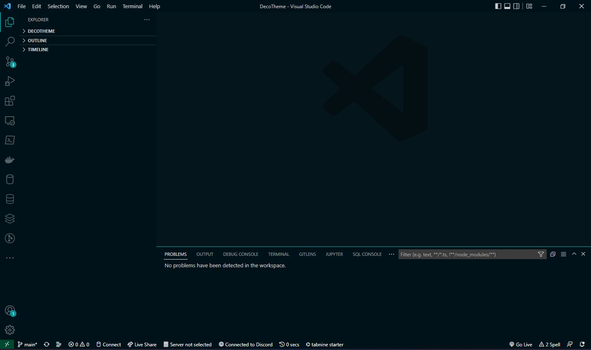

# DecoTheme - VS Code theme

A visual Studio Code theme based on the vs codes dark theme,
this theme is for those who like a simple look and work late under poor lighting conditions.

## Installation
1.  Open Visual Studio Code
2.  Open the Extensions menu
3.  Search for `DecoTheme` 
4.  Click Install
5.  click on Code > Preferences > Color Theme > Deco

## Contributing
if you guys want to contribute to this project make sure to clone it.

## Extra links
Extension also available at : https://marketplace.visualstudio.com/items?itemName=ParsaDehghani.DecoTheme

## Warning
the deco theme is still underdevelopment and will see drastic changes to improve the syntax coloring and more 

**Enjoy!**
